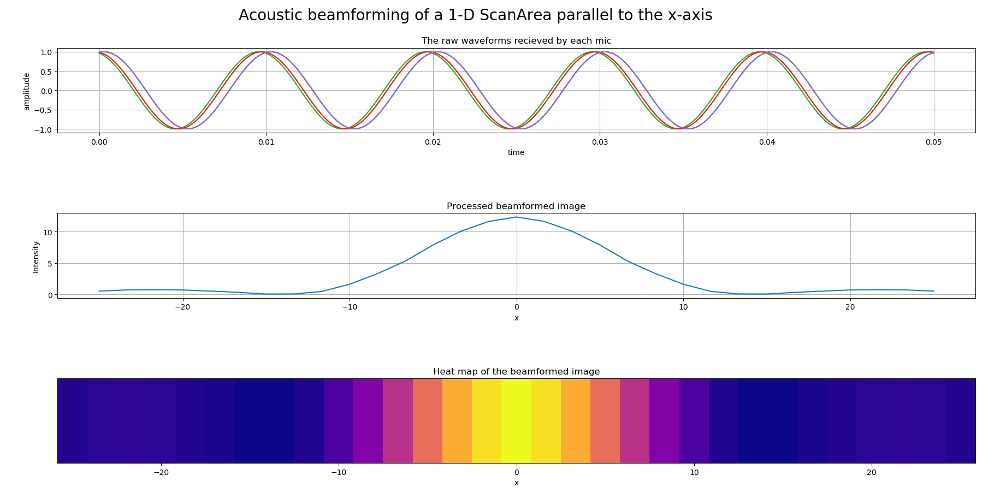

# Running the Acoustic Camera Simulator

1. Make sure you have matplotlib and numpy installed.
2. Enter this directory.
3. On command line, run using `python main.py`.

# Code explanation

This is a simulation program to test out implementations of a microphone-array acoustic camera.

The first subplot shows the raw waveforms received by each mic. The second shows the processed beamformed image, which shows a rough spike corresponding to where the virtual sound source is. The third plot is the head map of the beamformed image.

In a typical implementation, main.py will include the following:

1. Beamforming function: A function that contains any kind of beamforming algorithm (delay-and-sum in our case).
2. ScanArea object: Represents a linear region which will be scanned by the acoustic camera.
3. Source object: Represents a simple sine wave sound source.
5. micArray object: Represents a linear arrangement of mics along the x axis.
5. Calling `micArray.generateWaveform()`.
6. Calling the beamforming function.
7. Plotting the results.

# Tweaking code

You can 'play around' in this simulator by doing the following:

* **Change micArray parameters:** For now, only a linear micArray can be implemented. You can vary the number of mics or length of the array. 
* **Change sound source position and frequency:** The `Source` constructor takes these arguments. Currently only single source which generates a sine wave is supported. 
* **Change the kind of beamforming algorithm:** Currently a bare-bones simplistic delay-and-sum algorithm has been implemented.

